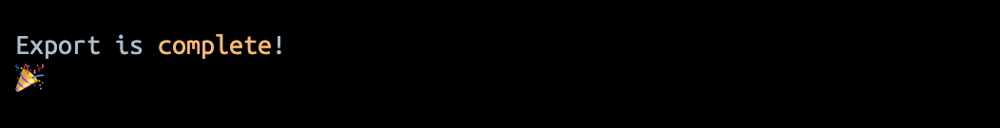

# export-from-keycloak

This repository contains shell scripts to export users from Keycloak

There are three methods for exporting users from Keycloak

1. [`DIFFERENT_FILES`](docs/different-files.md)
2. [`REALM_FILE`](docs/realm-file.md)
3. [`SAME_FILE`](docs/same-file.md)

Each script indicates it is starting

And that it has completed

_Colours and characters depend on the terminal_
